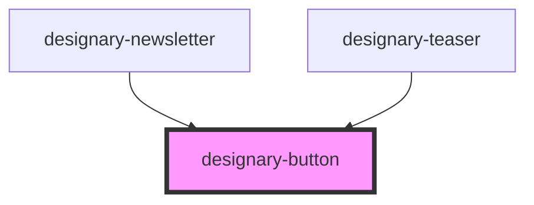

# designary-button

<!-- Auto Generated Below -->

## Properties

| Property | Attribute | Description | Type     | Default     |
| -------- | --------- | ----------- | -------- | ----------- |
| `color`  | `color`   |             | `string` | `undefined` |
| `size`   | `size`    |             | `string` | `undefined` |
| `title`  | `title`   |             | `string` | `undefined` |

## Dependencies

### Used by

 - [designary-newsletter](../designary-newsletter)
 - [designary-teaser](../designary-teaser)

### Graph

----------------------------------------------

*Built with [StencilJS](https://stenciljs.com/)*
