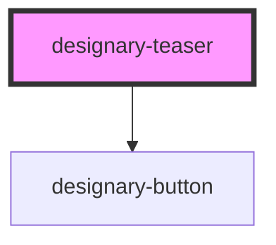

# designary-teaser

<!-- Auto Generated Below -->

## Properties

| Property   | Attribute  | Description | Type     | Default     |
| ---------- | ---------- | ----------- | -------- | ----------- |
| `class`    | `class`    |             | `string` | `undefined` |
| `imageurl` | `imageurl` |             | `string` | `undefined` |
| `title`    | `title`    |             | `string` | `undefined` |

## Dependencies

### Depends on

- [designary-button](../designary-button)

### Graph

----------------------------------------------

*Built with [StencilJS](https://stenciljs.com/)*
